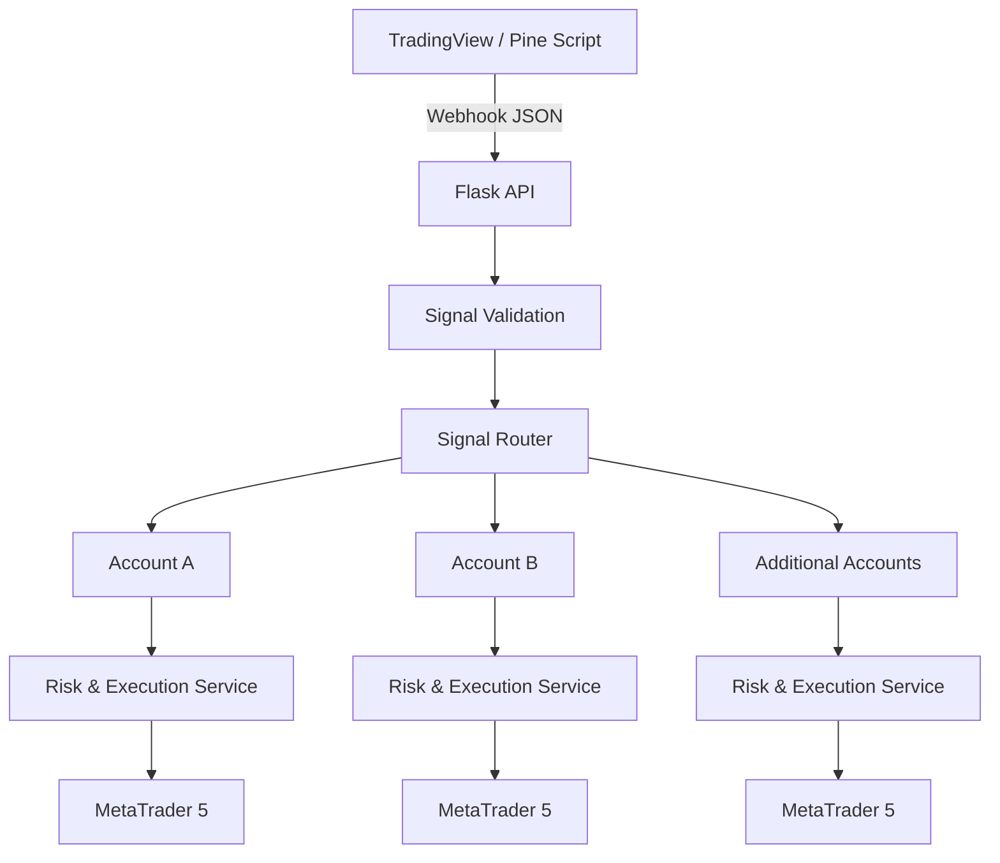

# Trading Automation System

[](https://github.com/AgentTrade/trading-automation-system/actions/workflows/tests.yml)

A portfolio-safe implementation of an event-driven trading execution architecture that turns rule-based TradingView signals into validated, routed and risk-sized execution requests for MetaTrader 5 environments.

> **Portfolio scope:** this repository demonstrates the software architecture. Production credentials, broker identifiers, proprietary strategy rules and sensitive account-allocation logic are intentionally excluded.

## Why I built it

The original goal was straightforward: remove manual execution and reduce the human factor from a deterministic trading process. The project evolved from a single TradingView-to-MT5 connection into a multi-account architecture with validation, account-specific risk, execution isolation, logging and automated tests.

The production system has been exercised in live trading environments. This public repository is a simplified implementation designed to make the engineering decisions reviewable without publishing proprietary trading logic.

## Architecture



The layers are deliberately separated so webhook handling, validation, routing and execution behavior can be tested independently.

## Core capabilities

- TradingView webhook ingestion through Flask
- payload validation and normalization before execution
- centralized account configuration
- multi-account signal routing with enabled/disabled account state
- account-specific percentage risk and position sizing
- broker-side execution abstraction for MetaTrader 5 integration
- exit and break-even command abstractions
- per-account fault isolation: one execution failure does not prevent other routed accounts from being processed
- structured lifecycle logging for received, validated, routed, successful, failed and rejected signals
- health endpoint for service checks
- automated unit/integration tests and GitHub Actions CI

## API

### `GET /health`

Returns service status and the number of configured execution accounts.

Example response:

```json
{
  "status": "ok",
  "service": "trading-automation-system",
  "configured_accounts": 2
}
```

### `POST /webhook`

Example TradingView payload:

```json
{
  "symbol": "EURUSD",
  "side": "buy",
  "stop_distance": 25.0,
  "target_distance": 50.0
}
```

The validation layer rejects malformed or unsupported requests before they reach routing or execution. It checks required fields, trade direction, symbol formatting, numeric distances and positive stop/target values.

Example successful response shape:

```json
{
  "status": "processed",
  "successful_executions": 2,
  "failed_executions": 0,
  "executions": [
    {
      "account": "account_primary",
      "symbol": "EURUSD",
      "side": "BUY",
      "volume": 2.0,
      "success": true,
      "message": "Portfolio simulation: execution request validated."
    }
  ]
}
```

## Reliability design

### Broker price differences

TradingView and MT5 brokers do not necessarily expose identical prices. In the production design, protective levels are therefore derived from broker-side live pricing rather than assuming the chart feed and execution feed are identical.

### TradingView state vs. broker state

A chart-side trade state cannot be treated as authoritative for a broker position. The production exit design therefore verifies and manages the actual broker-side position instead of relying only on TradingView's displayed state.

### Partial execution failure

A multi-account system should not turn one account-specific failure into a portfolio-wide failure. The webhook layer isolates execution exceptions per routed account, records the failed result and continues processing the remaining accounts.

### Operational recovery

The production workflow was designed so server or terminal restarts do not require rebuilding the execution environment manually. Recovery procedures restart required services and verify the environment before normal operation resumes.

## Repository structure

```text
trading-automation-system/
├── .github/
│   └── workflows/
│       └── tests.yml
├── examples/
│   └── tradingview_payload.json
├── src/
│   ├── app.py
│   ├── config.py
│   ├── execution.py
│   ├── logging_config.py
│   ├── router.py
│   └── validation.py
├── tests/
│   ├── test_execution.py
│   ├── test_router.py
│   ├── test_validation.py
│   └── test_webhook.py
├── .gitignore
├── requirements.txt
└── README.md
```

## Run locally

Requirements: Python 3.12+.

```bash
git clone https://github.com/AgentTrade/trading-automation-system.git
cd trading-automation-system
python -m venv .venv
```

Activate the virtual environment, then install dependencies:

```bash
pip install -r requirements.txt
```

Start the Flask service:

```bash
python src/app.py
```

Test the health endpoint:

```bash
curl http://127.0.0.1:5000/health
```

Send the included example signal:

```bash
curl -X POST http://127.0.0.1:5000/webhook \
  -H "Content-Type: application/json" \
  --data @examples/tradingview_payload.json
```

## Testing and CI

Run the test suite locally with:

```bash
pytest -v
```

The tests cover validation, routing, position sizing, execution requests, webhook behavior, invalid requests, health checks and partial execution failure. GitHub Actions runs the suite automatically on pushes and pull requests to `main`.

## Development approach

The system was built iteratively around real execution problems:

1. decompose trading rules into deterministic components
2. connect TradingView alerts to Python webhook processing
3. connect the execution layer to MT5 environments
4. test on small live accounts and compare chart-side signals with broker-side behavior
5. inspect logs and investigate mismatches
6. redesign state and exit handling where real price-feed differences exposed assumptions
7. extend the architecture to multiple accounts and account-specific risk
8. add validation, configuration separation, automated tests, CI, logging and fault isolation

AI-assisted development has been part of the implementation workflow. My role has focused on system design, requirement decomposition, execution logic, testing, debugging and validation against real trading conditions.

## Tech stack

**Python 3.12 · Flask · REST-style webhooks · Pine Script · TradingView · MetaTrader 5 · pytest · GitHub Actions**

## Project status

The architecture has progressed from a single-account prototype to a multi-account automation system. The public code is intentionally a portfolio implementation rather than a deployable copy of the proprietary production strategy.
